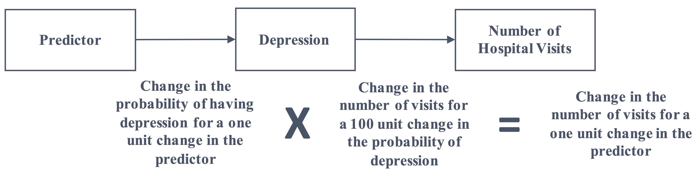
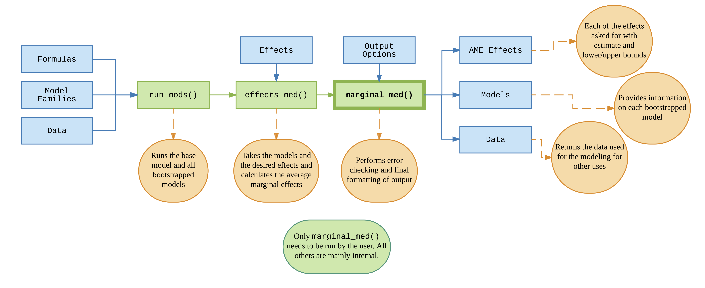
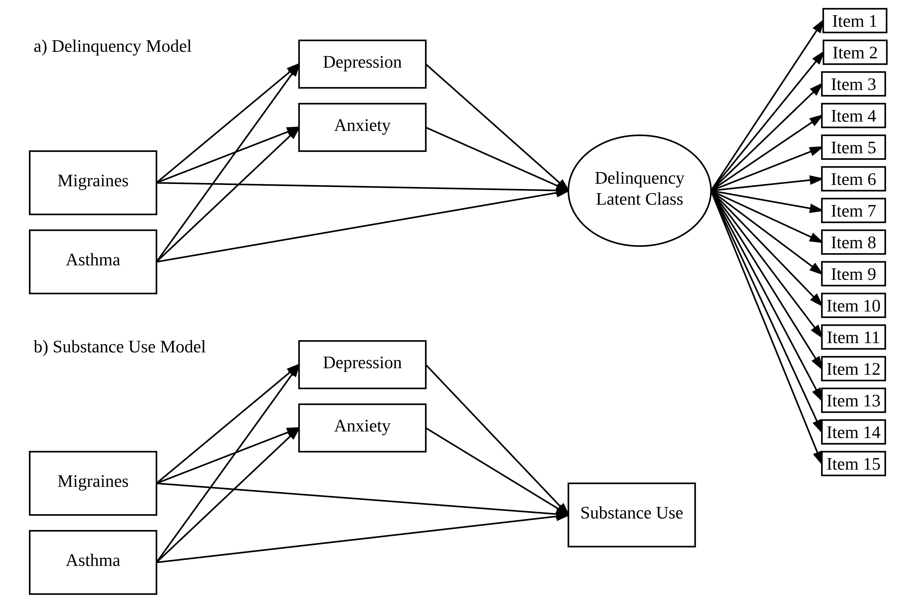

```{r setup, include=FALSE}
options(htmltools.dir.version = FALSE)
```
class: inverse

# Outline

--

## 1. Reproducibility and Effect Sizes
--

## 2. Mediation Analysis Lacks Effect Sizes
--

## 3. Average Marginal Effects Can Help
--

## 4. Marginal Mediation (What and Why)
--

## 5. Proposed Methods

---
# Reproducibility

Quick Definitions

1. **Methods Reproducibility**: replicate results with *same methods and data*

--

1. **Results Reproducibility**: replicate results with same methods and *independent data*

--

1. **Inference Reproducibility**: replicate *inference* with same methods and same or independent data

--

Here, we will be mainly discussing results reproducibility.

---
# Reproducibility

.pull-left[
Pychological Science (and Science in general) is undergoing a "reproducibility crisis"

Many recommendations to improve:

- No reliance on Null Hypothesis Significance Testing (NHST;  Cumming, 2014)
- In its place, use *Effect Sizes* and *Confidence Intervals*

.footnote[
Cumming, G. (2014). The New Statistics: Why and How. *Psych. Science*.
]
]


.pull-right[
```{r, echo=FALSE, message=FALSE, warning=FALSE, fig.align='center', fig.height=6, fig.width=7}
library(tidyverse)
set.seed(84321)
## Quick Effect Size + Uncertainty Plot
eci = data.frame(
  y = c(2,3,1,2.5,.5),
  x = c(1,2,3,4,5)
) %>%
  mutate(ymin = y - runif(5, min = .1)) %>%
  mutate(ymax = y + runif(5, min = .1))
ggplot(eci, aes(factor(x, labels = paste("Variable", 1:5)), y)) +
  geom_point(size = 3, shape = 21, fill = "steelblue", color = "dodgerblue4", 
             alpha = .9) +
  geom_errorbar(aes(ymin = ymin, ymax = ymax),
                size = 1.5, color = "dodgerblue4",
                width = .1,
                alpha = .8) +
  coord_flip() +
  labs(x = "",
       y = "Effect Size") +
  anteo::theme_anteo_wh()
```
]

---
# Reproducibility and Mediation Analysis

How does this "crisis" affect mediation analysis?

- Cumming (2014), and now the APA in general, recommend using **effect sizes and confidence intervals**

--

  - Mediation analysis lacks intuitive and interpretable effect size measures in many situations
    
  - Needs remedy to make mediation useful across the data situations faced by researchers (e.g., nominal, ordinal, count, and binary variables)

---
# Mediation Analysis

.pull-left[
A series of regressions

Simplest situation shown below and at right:

$$
Y = c_0 + b_1 M + c'_1 X + e_1
$$

$$
M = a_0 + a_1 X + e_2
$$

Used extensively in prevention science research

]

.pull-right[
```{r, echo=FALSE, message=FALSE, warning=FALSE, fig.align='center', fig.height=5, fig.width=7}
library("lavaan")

# Example 5.8 from mplus user guide:
Data <- data.frame(
  Y = rnorm(100),
  X = rnorm(100),
  M = rnorm(100)
)

# Model:
model.Lavaan <- '
  M ~ X
  Y ~ M + X
'
fit <- cfa(model.Lavaan, data=Data, std.lv=TRUE)

# Plot path diagram:
library(semPlot)
semPaths(fit,title=FALSE, curvePivot = TRUE,
         edgeLabels = c("a", "b", "c'"),
         edge.label.cex = 2,
         layout = "spring",
         sizeMan = 12)
```
]

--

Presents information regarding the pathway: from X to M to Y

```{r, message=FALSE, warning=FALSE, echo=FALSE}
library(tidyverse)
data.frame(
  effect = c("Indirect Effect", "Direct Effect", "Total Effect"),
  definition = c("a * b", "c'", "a * b + c'")
) %>%
  DT::datatable(options = list(dom = "t"),
                rownames = FALSE)
```

---
# But...

Mediation analysis does not have the following when the mediator and/or outcome is categorical:

- intuitive interpretation
- defined effect sizes (indirect or total)
- meaningful confidence intervals

--

### Why?

Suppose: X is continuous, M is binary, and Y is continuous.

```{r, message=FALSE, warning=FALSE, echo=FALSE}
data.frame(
  model = c("X - M", "M - Y", "X - Y"),
  type = c("logistic", "OLS", "OLS")
) %>%
  DT::datatable(options = list(dom = "t"),
                rownames = FALSE)
```

How do we combine logistic and OLS coefficients?

---
# Current Approaches

```{r, echo=FALSE}
data.frame(
  Approach = c("Simple", "SEM", "Standardize", "Ignore"),
  What = c("Interpret each path separately",
           "Use SEM's approach (probit threshold function)",
           "Standardize the coefficients",
           "Pretend all variables are continuous"),
  Pros = c("Easy", 
           "Powerful, Well-designed, Easy to Implement", 
           "Provides significance test of indirect effect",
           "Easy"),
  Cons = c("Ignores some information",
           "Only works with ordinal variables",
           "Assumptions (distributions), difficult to interpret beyond p-value",
           "Purposeful mis-specification, poor model fit")
) %>%
  DT::datatable(options = list(dom = "t"),
                rownames = FALSE)
```

--

Still missing: *intuitive, interpretable effect size measures with meaningful confidence intervals*

---
# Average Marginal Effects

The *average* of the marginal effect (it is a post-estimation approach) (Bartus, 2005):

--

#### Definition: Continuous Variable
$$
AME_k = \beta_k \frac{1}{n} \sum_i^n f(\beta x_i)
$$
where $f$ is the derivative of the estimate with respect to $x_i$, the $\beta x_i$ refers to the linear combination of the predictors, and $AME_k$ is the average marginal effect for the $kth$ variable. 

--

#### Definition: Dummy Coded Variable
$$
AME_{k} = \frac{1}{n} \sum_i^n [ F(\beta x_i | x_i = 1) - F(\beta x_i | x_i = 0) ]
$$
where $F(\beta x_i | x_i = 1)$ is the predicted value of the $ith$ observation when the dummy variable equals one and $F(\beta x_i | x_i = 0)$ is the predicted value when the dummy value equals zero. 

---
# Average Marginal Effects

Both the continuous and dummy variable AME are the averages (as the name implies)---averages of the effect of a one unit increase of the $x_i$ variable. 

In linear models, it is the estimate coefficient (the derivative is equal to the coefficient)

In Generalized Linear Models (GLMs) such as logistic regression, it is more complicated.

- The derivative (marginal effect) generally depends on the values of the covariates

.center[EXAMPLES...]


---
# Example

.pull-left[

#### Linear Model

$$
Y = \beta_0 + \sum_j^p \beta_j X_j + e_i
$$

The marginal effect of, say, $X_1$ is:
$$
\frac{\delta Y}{\delta X_1} = \beta_1
$$
]

--

.pull-right[

#### Logistic Regression

$$
logit(Y) = \beta_0 + \sum_j^p \beta_j X_j + e_i
$$
$$
log(\frac{Prob(Y = 1)}{1 - Prob(Y = 1)}) = \beta_0 + \sum_j^p \beta_j X_j + e_i
$$

$$
\frac{Prob(Y = 1)}{1 - Prob(Y = 1)} = e^{\beta_0 + \sum_j^p \beta_j X_j + e_i}
$$

$$
Prob(Y = 1) = \frac{e^{\beta_0 + \sum_j^p \beta_j X_j + e_i}}{1 + e^{\beta_0 + \sum_j^p \beta_j X_j + e_i}}
$$

The marginal effect of, say, $X_1$ is:
$$
\frac{\delta Y}{\delta X_1} = \frac{e^{\beta_0 + \sum_j^p \beta_j X_j + e_i}}{(1 + e^{\beta_0 + \sum_j^p \beta_j X_j + e_i})^2}
$$
]

---
# Average Marginal Effects

The derivative (marginal effect) generally depends on the values of the covariates

--
- What values should we use to get the marginal effect then?
- AME uses the actual values and then averages across all individuals

--

### Some Benefits:

1. intuitive -- they are in the original metric of the dependent variable
1. interpretable -- they refer to the change in the dependent variable for a one unit change in the independent
1. meaningful confidence intervals -- using bootstrapping (used here) or the delta method

--

.center[Why not use Average Marginal Effects with mediation analysis?]

---
class: inverse, center, middle
# Marginal Mediation 

---
# The What

It is two step approach

1. Estimate the mediation model (via OLS or GLM)
1. Compute the average marginal effects of each path

--

Since each path is the additive change, the combination of paths is much more straightforward

--

#### Example with Binary Mediator and Count Outcome



---
# Interpretation

Since this method can handle all sorts of combinations of variable types, here are some interpretation guidelines.

### Principle 1: The individual paths are interpreted based on the corresponding endogenous variable's original metric.

--
### Principle 2: The indirect effect, as a combination of the a and b paths, are interpreted based on the outcome's original metric.

--
### Principle 3: Both the direct and total effects are interpreted based on the outcome's original metric.

---
# Assumptions

The same assumptions as linear models or generalized linear models hold.

1. Correct distribution (normal in linear models)
1. Proper variance (homoskedastic in linear models)
1. Linear in parameters
1. Random sample
1. No measurement error
1. No omitted influences

--

Only additional assumption with AME included:

1. Marginal effect can be described *additively* (after accounting for all the covariates)

---
class: inverse, center, middle
# Proposed Methods

---
## 1. Development

- to develop the approach and the software

--

## 2. Monte Carlo Simulation Study

- to understand the finite sampling properties

--

## 3. Application Studies

- to apply Marginal Mediation to prevention data

---
# Development

Marginal Mediation will be established on linear regression---either ordinary least squares for continuous outcomes/mediators or maximum likelihood for categorical outcomes/mediators and will include the post-estimation step.

Various considerations for each type of mediator/outcome variable (multinomial, count, ordinal, dichotomous): 

1. An appropriate manner in which to integrate moderation (interaction effects) into the framework is important. 
1. It has been noted that in non-linear models the $a * b + c'$ generally does not equal the $c$ path as it does in linear models (MacKinnon, Chapter 11). It is expected that these will equal within the Marginal Mediation framework. 


---
# Software Development

- R statistical environment -- distributed through "CRAN"
- Consist of a number of functions to fit the model and assess the model’s fit while efficiently producing the paths and effects in proper units
- The package will apply the best practices for both computational speed and user readability (Wickham, 2015), 
   - Allows other researchers to extend the package more easily 
   - Includes built-in tests performed on Linux, Mac, and Windows platforms




---
# Monte Carlo Simulation

#### The "a" Path Population Model 
- where the $Prob(M = 1)$ is a latent continuous variable with a linear or logistic relationship with the predictors
- the $e_i$ is normally distributed with $M = 0$ and $SD = 1$.
$$
Prob(M = 1)_i = a_0 + a_1 x_c + a_2 x_d + e_i
$$
The observed variable, $M_i$, is defined as follows: $M_i = 0$ if $Prob(M = 1) < .5$ and $M_i = 1$ otherwise.

--

#### The "b" and "c'" Path Population Model
$$
Y_i = b_0 + b_1 M_i + c'_1 x_c + c'_2 x_d + e_i
$$

---
# Monte Carlo Simulation

```{r, message=FALSE, warning=FALSE, echo=FALSE}
tab = read.csv("~/Dropbox/1 Dissertation/Manuscript/Data/ConditionsTable.csv")
names(tab) = c("Independent Variables", "Conditions")
tab[, 1:2] %>%
  DT::datatable(rownames = FALSE,
                options = list(dom = "t"))
```

--

Each condition will have 500 replications.

---
# Application Studies



---
class: inverse, center, middle

# Thank you.
# 🙂

