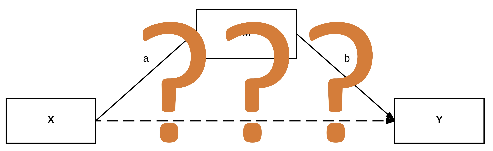
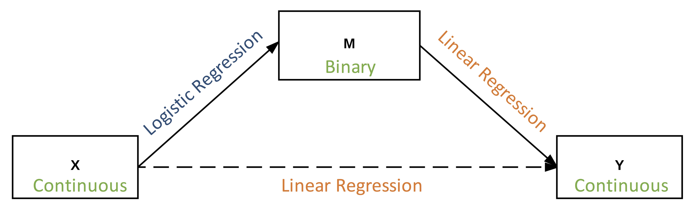

```{r setup, include=FALSE}
options(htmltools.dir.version = FALSE)
```
class: inverse
count: false

# Outline

--

## 1. Reproducibility and Effect Sizes
--

## 2. Mediation Analysis Lacks Effect Sizes
--

## 3. Average Marginal Effects Can Help
--

## 4. Marginal Mediation (What and Why)
--

## 5. Proposed Methods

---
# Reproducibility

.large[
1. **Methods**: replicate results with *same methods and data*

1. **Results**: replicate results with same methods and *independent data*
]

--

</br></br>
.center[.large[**A Reproducibility Crisis**]]

--

The most adopted suggestion to improve by the APA:

- No reliance on Null Hypothesis Significance Testing (Cumming, 2014)

- In its place, use **Effect Sizes** and **Confidence Intervals**

--
</br></br>
.center[.large[
Note: *"Without an interpretable scale, it is difficult to use effect size to communicate results in a meaningful and useful way."* — Preacher and Hayes, 2011
]
]

```{r, eval=FALSE, echo=FALSE, message=FALSE, warning=FALSE, fig.align='center', fig.height=6, fig.width=7}
library(tidyverse)
set.seed(84321)
## Quick Effect Size + Uncertainty Plot
eci = data.frame(
  y = c(2,3,1,2.5,.5),
  x = c(1,2,3,4,5)
) %>%
  mutate(ymin = y - runif(5, min = .1)) %>%
  mutate(ymax = y + runif(5, min = .1))
ggplot(eci, aes(factor(x, labels = paste("Variable", 1:5)), y)) +
  geom_point(size = 3, shape = 21, fill = "steelblue", color = "dodgerblue4", 
             alpha = .9) +
  geom_errorbar(aes(ymin = ymin, ymax = ymax),
                size = 1.5, color = "dodgerblue4",
                width = .1,
                alpha = .8) +
  coord_flip() +
  labs(x = "",
       y = "Effect Size") +
  anteo::theme_anteo_wh()
```

---
# Reproducibility and Mediation Analysis

.mlarge[How does the APA's recommendation---**effect sizes and confidence intervals**---affect Prevention Science?]

--

*Mediation Analysis*:
- Lacks intuitive and interpretable effect sizes in many situations
--

- *Limits its utility and raises questions about best practices*

--



---
# What is Mediation Analysis? Why is it important?

.pull-left[
A series of regressions (path analysis):

$$
Y = c_0 + b_1 M + c'_1 X + e_1
$$

$$
M = a_0 + a_1 X + e_2
$$

Used extensively in Prevention Science research

- Info on *how* a variable affects another
- Info on *individual paths* and *entire process*
- Info on *actionable targets of intervention*

]

.pull-right[
```{r, echo=FALSE, message=FALSE, warning=FALSE, fig.align='center', fig.height=4, fig.width=6}
library("lavaan")

# Example 5.8 from mplus user guide:
Data <- data.frame(
  Y = rnorm(100),
  X = rnorm(100),
  M = rnorm(100)
)

# Model:
model.Lavaan <- '
  M ~ X
  Y ~ M + X
'
fit <- cfa(model.Lavaan, data=Data, std.lv=TRUE)

# Plot path diagram:
library(semPlot)
semPaths(fit,
         title=FALSE, curvePivot = TRUE,
         edgeLabels = c("a", "b", "c'"),
         edge.label.cex = 2,
         layout = "spring",
         sizeMan = 12,
         shapeMan = "rectangle",
         border.color = "dodgerblue4",
         border.width = 3,
         node.width = 1.5,
         node.height = 1,
         mar = c(4,6,5,6))
```
]

--

```{r, message=FALSE, warning=FALSE, echo=FALSE}
library(tidyverse)
data.frame(
  Effects = c("Indirect Effect", "Direct Effect", "Total Effect"),
  Definitions = c("a * b", "c'", "a * b + c'")
) %>%
  DT::datatable(options = list(dom = "t"),
                rownames = FALSE,
                colnames = c("Effects of Interest", "Definitions"))
```

---
# But...

When the mediator and/or outcome is **categorical/non-normal**, mediation analysis does not have:

- intuitive interpretation
- defined effect sizes (indirect or total)
- meaningful confidence intervals

--

**Why?**



???
How do we combine logistic and OLS coefficients?

Generally, we are looking at the **marginal effect** of a variable on another (it is additive)

To have any meaningful interpretation, need additive

Adjusting to Odds Ratios doesn't help (it creates a multiplicitive effect instead of additive)

---
# Why the big fuss?

.pull-left[
#### Linear Model

$$
Y = \beta_0 + \sum_j^p \beta_j X_j + e_i
$$

The marginal effect of, say, $X_1$ is:
$$
\frac{\delta Y}{\delta X_1} = \beta_1
$$
]

--

.pull-right[

#### Logistic Regression

$$
logit(Y) = \beta_0 + \sum_j^p \beta_j X_j + e_i
$$
$$
log(\frac{Prob(Y = 1)}{1 - Prob(Y = 1)}) = \beta_0 + \sum_j^p \beta_j X_j + e_i
$$

$$
\frac{Prob(Y = 1)}{1 - Prob(Y = 1)} = e^{\beta_0 + \sum_j^p \beta_j X_j + e_i}
$$

$$
Prob(Y = 1) = \frac{e^{\beta_0 + \sum_j^p \beta_j X_j + e_i}}{1 + e^{\beta_0 + \sum_j^p \beta_j X_j + e_i}}
$$

The marginal effect of, say, $X_1$ is:
$$
\frac{\delta Y}{\delta X_1} = \frac{e^{\beta_0 + \sum_j^p \beta_j X_j + e_i}}{(1 + e^{\beta_0 + \sum_j^p \beta_j X_j + e_i})^2}
$$
]

???
The derivative (marginal effect) generally depends on the values of the covariates

To simply combine effects, like in linear regression, we need the estimate to be **additive**

---
count: false
# Why the big fuss?  --> Marginal Effect depends on all covariates

.pull-left[
#### Linear Model

$$
Y = \beta_0 + \sum_j^p \beta_j X_j + e_i
$$

The marginal effect of, say, $X_1$ is:
$$
\frac{\delta Y}{\delta X_1} = \beta_1
$$
]

.pull-right[

#### Logistic Regression

$$
logit(Y) = \beta_0 + \sum_j^p \beta_j X_j + e_i
$$
$$
log(\frac{Prob(Y = 1)}{1 - Prob(Y = 1)}) = \beta_0 + \sum_j^p \beta_j X_j + e_i
$$

$$
\frac{Prob(Y = 1)}{1 - Prob(Y = 1)} = e^{\beta_0 + \sum_j^p \beta_j X_j + e_i}
$$

$$
Prob(Y = 1) = \frac{e^{\beta_0 + \sum_j^p \beta_j X_j + e_i}}{1 + e^{\beta_0 + \sum_j^p \beta_j X_j + e_i}}
$$

The marginal effect of, say, $X_1$ is:
$$
\frac{\delta Y}{\delta X_1} = \frac{e^{\beta_0 + \sum_j^p \beta_j X_j + e_i}}{(1 + e^{\beta_0 + \sum_j^p \beta_j X_j + e_i})^2}
$$
]

???
The derivative (marginal effect) generally depends on the values of the covariates

To simply combine effects, like in linear regression, we need the estimate to be **additive**


---
# Current Approaches

```{r, echo=FALSE, message=FALSE, warning=FALSE}
data.frame(
  Number = 1:5,
  Approach = c("Series of logistic regressions",
               "Use SEM's approach (polychoric correlation)",
               "Standardize the coefficients",
               "Interpret each path separately",
               "Pretend all variables are continuous"),
  Pros = c("Simple to apply in most software", 
           "Powerful, well-designed,\nEasy to implement with proper software", 
           "Provides significance test\nof indirect effect",
           "Simplest approach with proper models",
           "Simplest approach"),
  Cons = c("Ignores some information,\n cannot obtain indirect effect size",
           "Only works with ordinal variables,\n only standardized effect sizes",
           "Assumptions (distributions), difficult to interpret beyond p-value",
           "Ignores some information,\n cannot obtain indirect effect size",
           "Purposeful mis-specification, poor model fit")
) %>%
  DT::datatable(options = list(dom = "t"),
                rownames = FALSE) %>%
  DT::formatStyle(c("Number"),
                  target = "row",
                  color = DT::styleEqual(c("1", 
                                           "2", 
                                           "3", 
                                           "4",
                                           "5"), 
                                         c("black", "black", "white", "white", "white")))
```
---
count: false

# Current Approaches

```{r, echo=FALSE, message=FALSE, warning=FALSE}
data.frame(
  Number = 1:5,
  Approach = c("Series of logistic regressions",
               "Use SEM's approach (polychoric correlation)",
               "Standardize the coefficients",
               "Interpret each path separately",
               "Pretend all variables are continuous"),
  Pros = c("Simple to apply in most software", 
           "Powerful, well-designed,\nEasy to implement with proper software", 
           "Provides significance test\nof indirect effect",
           "Simplest approach with proper models",
           "Simplest approach"),
  Cons = c("Ignores some information,\n cannot obtain indirect effect size",
           "Only works with ordinal variables,\n only standardized effect sizes",
           "Assumptions (distributions), difficult to interpret beyond p-value",
           "Ignores some information,\n cannot obtain indirect effect size",
           "Purposeful mis-specification, poor model fit")
) %>%
  DT::datatable(options = list(dom = "t"),
                rownames = FALSE) %>%
  DT::formatStyle(c("Number"),
                  target = "row",
                  color = DT::styleEqual(c("1", 
                                           "2", 
                                           "3", 
                                           "4",
                                           "5"), 
                                         c("black", "black", "black", "black", "black")))
```

--

</br>
.center[.mlarge[*Intuitive, interpretable effect size measures with meaningful confidence intervals*? </br> No.]]

---
# Average Marginal Effects

The *average* of the marginal effects (Bartus, 2005):

--

.pull-left[
#### Definition: Continuous Variable
$$
AME_k = \beta_k \frac{1}{n} \sum_i^n f(\beta x_i)
$$
where $f$ is the derivative of the estimate with respect to $x_i$, the $\beta x_i$ is the linear combination of the predictors, and $AME_k$ is the average marginal effect for the $kth$ variable. 
]

--

.pull-right[
#### Definition: Dummy Coded Variable
$$
AME_{k} = \frac{1}{n} \sum_i^n [ F(\beta x_i | x_i = 1) - F(\beta x_i | x_i = 0) ]
$$
where $F(\beta x_i | x_i = 1)$ is the predicted value of the $ith$ observation when the dummy variable equals one and $F(\beta x_i | x_i = 0)$ is the predicted value when the dummy value equals zero. 
]

--

</br>
</br>
.center[.large[*Intuitive, interpretable effect size measures with meaningful confidence intervals*? </br> Yes.]]

???
Since the derivative (marginal effect) generally depends on the values of the covariates

*What values should we use to get the marginal effect then?*

AME uses **the actual values** and then averages across all individuals

---
# Average Marginal Effects

.large[*intuitive* -- they are in the original metric of the dependent variable]

.large[*interpretable* -- they refer to the change in the dependent variable for a one unit change in the independent]

.large[*meaningful confidence intervals* -- using bootstrapping (used here) or the delta method]

--

.center[
.large[*Again, these qualities are lacking in mediation analysis.*] </br></br></br>
So... (Punchline) </br></br>
.large[**Let's use Average Marginal Effects with mediation analysis**]
]

---
class: inverse, center, middle
count: false
# Marginal Mediation 

---
background-image: url(fig_threestep.jpg)
background-position: 80% 85%
background-size: 800px

# Marginal Mediation 

.left-column[
## Three Step Approach
]

---
# Interpretation

Since this method can handle all sorts of combinations of variable types, here are some interpretation guidelines.

### Principle 1: The individual paths are interpreted based on the corresponding endogenous variable's original metric.

--
### Principle 2: The indirect effect, as a combination of the a and b paths, are interpreted based on the outcome's original metric.

--
### Principle 3: Both the direct and total effects are interpreted based on the outcome's original metric.

---
# Interpretation

#### Example with Binary Mediator and Count Outcome


---
# Assumptions

.left-column[
### The same assumptions as linear models or generalized linear models hold.

</br></br>
.coral[### Only additional assumption with AME:]
]

--

.right-column[
1. Correct distribution (normal in linear models)

1. Proper variance (homoskedastic in linear models)

1. Linear in parameters

1. Random sample

1. No measurement error

1. No omitted influences

</br></br>

### Marginal effect can be described *additively* (after accounting for all the covariates)
]


---
class: inverse, center, middle
count: false
# Proposed Methods

---
# Proposed Methods

## 1. Development

- to develop the approach and the software

--

## 2. Monte Carlo Simulation Study

- to understand the finite sampling properties, develop guidelines

--

## 3. Application Study

- to apply Marginal Mediation to prevention data

---
# Method Development

.large[Mediation as built on OLS and GLM]

---
count: false

# Method Development

.large[Mediation as built on OLS and GLM **+ Average Marginal Effects**]

--

</br>
Two *considerations* for each type of mediator/outcome variable (multinomial, count, ordinal, dichotomous): 

1. Need a way to integrate *moderation* (interaction effects) into the framework. 
    - Interactions with marginal effects are more complex.
1. Generally, 
$$
a * b + c' \neq c
$$
in non-linear models (it does equal in linear models; MacKinnon, Chapter 11). It is expected that these will equal (approx.) within the Marginal Mediation framework, but needs to be assessed.

???
Total effect does not equal total effect! This is a problem.

---
# Software Development

**R statistical environment** -- distributed worldwide through "CRAN"


---
count: false
# Software Development

**R statistical environment** -- distributed worldwide through "CRAN"

.left-column[
## Notes
]
.right-column[
1. Functions to assess model's fit and visualize model,
1. Will apply the best practices for both speed and user readability (Wickham, 2015), and
1. Will include built-in tests for Linux, Mac, and Windows platforms

Most important functions will be developed first so the next phase of the project can continue
]

.footnote[Future plans: apply benefits of other mediation modeling packages]

---
# Monte Carlo Simulation

#### The "a" Path Population Model 
- where the $Prob(M = 1)$ is a latent continuous variable with a linear or logistic relationship with the predictors
- the $e_i$ is normally distributed with $M = 0$ and $SD = 1$.
$$
Prob(M = 1)_i = a_0 + a_1 x_c + a_2 x_d + e_i
$$
The observed variable, $M_i$, is defined as follows: $M_i = 0$ if $Prob(M = 1) < .5$ and $M_i = 1$ otherwise.

--

</br>
#### The "b" and "c'" Path Population Model
$$
Y_i = b_0 + b_1 M_i + c'_1 x_c + c'_2 x_d + e_i
$$
where this $e_i$ also is normally distributed with $M = 0$ and $SD = 1$.

- $x_c$ is a continuous predictor
- $x_d$ is a dummy coded predictor

---
# Monte Carlo Simulation: Conditions

```{r, message=FALSE, warning=FALSE, echo=FALSE}
tab = read.csv("~/Dropbox/1 Dissertation/Manuscript/Data/ConditionsTable.csv")
names(tab) = c("Independent Variables", "Conditions")
tab[, 1:2] %>%
  DT::datatable(rownames = FALSE,
                options = list(dom = "t"))
```

--

Each condition will have 500 replications.

---
# Application Studies

The National Longitudinal Study of Adolescent Health (“Add Health”; Harris, Halpern, Haberstick, & Smolen, 2013)

Longitudinal data on adolescents (n = 14,960 at wave I)

.left-column[
# Wave I

</br>
</br>

# Wave II
]

--

.right-column[
**Predictors**: Parent report of the chronic conditions ("For each of the following health conditions, please tell me whether [your child] has [asthma, migraines]." 

**Mediators**: Depression (19 items) and Anxiety (7 items)

</br>
</br>

**Outcomes**: Delinquency (15 items) and substance use ("During the past 30 days, how many times have you used marijuana?" and "During the past two weeks, how many times did you have 5+ drinks on a single occasion?") 
]


---
background-image: url(fig_theorymed.jpg)
background-size: contain
background-repeat: no-repeat

---
# Conclusions

.large[Ultimately, this project will produce:

1. A new approach to mediation analysis that applies across a wide variety of situations

1. Guidelines for using the approach in finite samples

1. An example of the approach on prevention data

1. More evidence about the link between chronic physical conditions and poor behavioral outcomes
]

---
count: false
class: inverse, center, middle

# Thank you.

.footnote[
All references cited herein can be found in the proposal manuscript.
]

